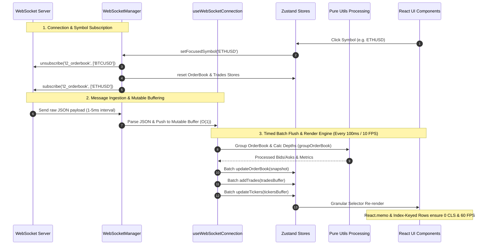

# Delta Trading Dashboard

A real-time, multi-symbol crypto trading dashboard built with React + TypeScript + Vite. It connects to a local WebSocket mock server and displays live order book data, recent trades, and ticker information across 6 symbols simultaneously.

---

## Quick Start

### Prerequisites

- **Node.js** `>= 20.x`
- **npm** `>= 9.x`

### 1. Clone the Repository

```bash
git clone <repository-url>
cd delta-trading-dashboard
```

### 2. Start the Backend Mock Server

The backend WebSocket server lives in the `socket-custom-load` directory. 
You can clone it from: https://github.com/saxenanickk/socket-custom-load

```bash
cd ../socket-custom-load
node index.js
```

> The backend starts on `ws://localhost:8080`. It broadcasts tickers for all 6 symbols and streams order book snapshots and trades for the active symbol.

### 3. Start the Frontend Dev Server

Open a second terminal:

```bash
cd delta-trading-dashboard
npm install
npm run dev
```

Visit `http://localhost:5173` in your browser.

---

## Available Scripts

| Command | Description |
|---|---|
| `npm run dev` | Start the Vite development server with HMR |
| `npm run build` | Type-check and build for production (`dist/`) |
| `npm run lint` | Run ESLint across the entire project |
| `npm run test` | Run the full Vitest unit test suite |
| `npm run preview` | Preview the production build locally |

---

## Features

- **Live Order Book** — Full-depth streaming snapshots with configurable grouping (`0.5`, `1`, `5`, `10` tick sizes), animated depth bars, and spread/imbalance metrics
- **Real-Time Trades Feed** — 100ms trade aggregation with large-trade detection (🔥), rolling 1-minute volume statistics, and auto-scroll with manual override
- **Ticker Bar** — 6-symbol live ticker with 24h price change indicators
- **Symbol Switcher** — Click any ticker to instantly swap the active symbol; old subscriptions are cleanly unsubscribed
- **Connection Status** — Live indicator for `connecting`, `connected`, `reconnecting`, and `disconnected` states with automatic exponential-backoff reconnection
- **Shimmer Loading UI** — Animated skeleton loaders appear while initial data is in flight; existing data is preserved (not wiped) on reconnects
- **Footer Legend** — Inline explanations for every visual affordance in the UI

---

## Architecture & System Design

See [`docs/02-ARCHITECTURE.md`](./docs/02-ARCHITECTURE.md) for a detailed breakdown of component boundaries, state management, WebSocket lifecycle, and data processing pipelines.

---

### High-Level Design (HLD)

The system is designed around a **Single-Connection, Buffered Ingestion & Isolated Render** paradigm. High-frequency WebSocket data is decoupled from React's rendering pipeline via mutable buffers and a 100ms flush loop.

```text
┌──────────────────────────────────────────────────────────────────────────────────────────┐
│                                 EXTERNAL SYSTEM                                          │
│                                                                                          │
│                  ┌──────────────────────────────────────────────────┐                    │
│                  │  WebSocket Server (ws://localhost:8080)          │                    │
│                  │  - Broadcasts tickers for 6 symbols              │                    │
│                  │  - Streams L2 Order Book & Trades for active sym │                    │
│                  └────────────────────────┬─────────────────────────┘                    │
└───────────────────────────────────────────┼──────────────────────────────────────────────┘
                                            │ Full-Duplex WebSockets (JSON Streams)
                                            ▼
┌──────────────────────────────────────────────────────────────────────────────────────────┐
│                                CLIENT APPLICATION                                        │
│                                                                                          │
│  ┌────────────────────────────────────────────────────────────────────────────────────┐  │
│  │ NETWORK & INGESTION LAYER                                                          │  │
│  │  ┌────────────────────────┐   ┌───────────────────────────┐   ┌─────────────────┐ │  │
│  │  │ WebSocketManager       │   │ Reconnection Engine       │   │ Subscription    │ │  │
│  │  │ (Pure TS Singleton)    ├──►│ (Exp Backoff 1s..30s)     │   │ Registry Map    │ │  │
│  │  └───────────┬────────────┘   └───────────────────────────┘   └─────────────────┘ │  │
│  └──────────────┼─────────────────────────────────────────────────────────────────────┘  │
│                 │ Synchronous Non-Blocking Push (O(1))                                   │
│                 ▼                                                                        │
│  ┌────────────────────────────────────────────────────────────────────────────────────┐  │
│  │ INGESTION & BUFFERING ENGINE (100ms Timed Flush Loop)                              │  │
│  │  ┌──────────────────────────────────────────────────────────────────────────────┐  │  │
│  │  │  mutable buffers: [latestOrderBookMsg, tradesBuffer[], tickersBuffer[]]      │  │  │
│  │  └──────────────────────────────────────┬───────────────────────────────────────┘  │  │
│  └─────────────────────────────────────────┼──────────────────────────────────────────┘  │
│                                            │ Batch Flush (10 FPS / 100ms)                │
│                                            ▼                                             │
│  ┌────────────────────────────────────────────────────────────────────────────────────┐  │
│  │ STATE MANAGEMENT LAYER (Zustand Stores)                                            │  │
│  │  ┌──────────────────┐  ┌──────────────────┐  ┌──────────────────┐  ┌─────────────┐ │  │
│  │  │ useMarketStore   │  │ useTickerStore   │  │ useOrderBookStore│  │useTradesStore│ │  │
│  │  │ (Focused Symbol) │  │ (All 6 Symbols)  │  │ (Grouped Bids/Ask│  │(Agg Trades &│ │  │
│  │  │ (Connection State│  │                  │  │  Spread Metrics) │  │ 1m Volume)  │ │  │
│  │  └────────┬─────────┘  └────────┬─────────┘  └────────┬─────────┘  └──────┬──────┘ │  │
│  └───────────┼─────────────────────┼─────────────────────┼───────────────────┼────────┘  │
│              │ Selective           │ Granular            │ Memoized          │ Index     │
│              │ Subscription        │ Selectors           │ Deep Bars         │ Zero-CLS  │
│              ▼                     ▼                     ▼                   ▼           │
│  ┌────────────────────────────────────────────────────────────────────────────────────┐  │
│  │ PRESENTATION & UI LAYER (React 18 Component Tree)                                  │  │
│  │  ┌──────────────────┐  ┌──────────────────┐  ┌──────────────────┐  ┌─────────────┐ │  │
│  │  │ GlobalHeader     │  │ TickerBar        │  │ OrderBookPanel   │  │ TradesPanel │ │  │
│  │  │ (Status Badge)   │  │ (Ticker Cards)   │  │ (OrderBookRows)  │  │ (TradeRows) │ │  │
│  │  └──────────────────┘  └──────────────────┘  └──────────────────┘  └─────────────┘ │  │
│  └────────────────────────────────────────────────────────────────────────────────────┘  │
└──────────────────────────────────────────────────────────────────────────────────────────┘
```

<details>
<summary>Click to view Mermaid Diagram syntax</summary>

```mermaid
graph TD
    subgraph External System
        WS["WebSocket Server (ws://localhost:8080)"]
    end

    subgraph Client Application
        subgraph Network & Ingestion Layer
            WM["WebSocketManager (Singleton)"]
            RECON["Reconnection & Backoff Engine"]
            REG["Subscription Registry"]
        end

        subgraph Ingestion & Buffering Engine
            BUF["Mutable In-Memory Buffers\n(100ms Timed Flush)"]
        end

        subgraph State Management Layer (Zustand Stores)
            MKT["useMarketStore\n(Focused Symbol & Status)"]
            TCK["useTickerStore\n(All Symbols Ticker Data)"]
            OB["useOrderBookStore\n(Bids, Asks, Metrics)"]
            TRD["useTradesStore\n(Aggregated Trades, 1m Stats)"]
        end

        subgraph Presentation & UI Layer
            HDR["GlobalHeader\n(Status Indicator)"]
            TBAR["TickerBar\n(Isolated Ticker Cards)"]
            OBP["OrderBookPanel\n(Memoized Rows & Depth Bars)"]
            TP["TradesPanel\n(Index-Keyed Zero-CLS Rows)"]
            OEP["OrderEntryPanel\n(Form Controls)"]
        end
    end

    WS <-->|WebSockets JSON Stream| WM
    WM -->|Queue Messages| BUF
    BUF -->|Batch Flush 10 FPS| TCK
    BUF -->|Batch Flush 10 FPS| OB
    BUF -->|Batch Flush 10 FPS| TRD
    WM -->|Update Status| MKT

    MKT -->|Subscribe / Unsubscribe| WM
    MKT --> HDR
    TCK --> TBAR
    OB --> OBP
    TRD --> TP
```

</details>

---

### Low-Level Design (LLD) & Data Flow Architecture

This diagram illustrates the message ingestion lifecycle, batch processing transformations, store updates, and symbol switching workflows.

```text
┌────────────────────────────────────────────────────────────────────────────────────────────────────────┐
│                                     LOW-LEVEL DATA PIPELINE (LLD)                                      │
└────────────────────────────────────────────────────────────────────────────────────────────────────────┘

  [1. USER SYMBOL SWITCHING FLOW]
  User Click (e.g. ETHUSD)
     │
     ▼
  useMarketStore.setFocusedSymbol('ETHUSD')
     ├─────────────────────────────────────────┐
     │ 1. Unsubscribe Old                     │ 2. Subscribe New
     ▼                                         ▼
  WebSocketManager.unsubscribe('BTCUSD')   WebSocketManager.subscribe('ETHUSD')
     │                                         │
     ├─────────────────────────────────────────┤
     │ 3. Reset Stores immediately             │ 4. Clear old data from UI
     ▼                                         ▼
  useOrderBookStore.reset()                useTradesStore.reset()

──────────────────────────────────────────────────────────────────────────────────────────────────────────

  [2. HIGH-FREQUENCY INGESTION & TRANSFORMATION PIPELINE]

  Raw WebSocket Payload (1-5ms interval)
     │
     ▼
  WebSocketManager.onmessage()
     │
     ▼
  useWebSocketConnection (Mutable In-Memory Buffers)
     ├── latestOrderBookMsg = msg (Overwrites, keeps latest)
     ├── tradesBuffer.push(msg)   (Appends)
     └── tickersBuffer.push(msg)  (Appends)
     │
     │ [100ms Timed Flush Engine (setInterval @ 10 FPS)]
     ▼
  ┌──────────────────────────────────────────────────────────────────────────────────────────────────┐
  │ PARALLEL BATCH PROCESSING                                                                        │
  │                                                                                                  │
  │  OrderBook Branch:                                                                               │
  │  latestOrderBookMsg ──► groupOrderBook(tickSize) ──► processCumulativeDepths() ──► calculateMetrics()│
  │                                                                                     │            │
  │                                                                                     ▼            │
  │                                                                          useOrderBookStore       │
  │                                                                                     │            │
  │  Trades Feed Branch:                                                                │            │
  │  tradesBuffer[] ──► 100ms Trade Merging (Same price/direction) ──► Bound 50 Rows ─────┤            │
  │                 └──► 60s Rolling Volume Queue (Max 5,000) ──────► useTradesStore ◄──┘            │
  │                                                                                                  │
  │  Ticker Branch:                                                                                  │
  │  tickersBuffer[] ──► updateTickers(batch) ─────────────────────────► useTickerStore             │
  └──────────────────────────────────────────────────────────────────────────────────────────────────┘
     │
     ▼
  ┌──────────────────────────────────────────────────────────────────────────────────────────────────┐
  │ REACT UI RENDER ISOLATION LAYER                                                                  │
  │                                                                                                  │
  │  • TickerCard: Selects only state.tickers['ETHUSD'] (Prevents global re-renders)                 │
  │  • OrderBookRow: React.memo with custom areEqual (Renders only modified price levels)            │
  │  • TradesRow: Index-based React keys (DOM nodes locked in place -> CLS = 0.00)                   │
  └──────────────────────────────────────────────────────────────────────────────────────────────────┘
```

<details>
<summary>Click to view Sequence Diagram syntax</summary>



</details>

## Performance

See [`docs/03-PERFORMANCE-STRATEGY.md`](./docs/03-PERFORMANCE-STRATEGY.md) for an explanation of the buffering model, 100ms flush intervals, CLS elimination, and the main-thread vs. Web Worker tradeoff decision.

## Testing

See [`docs/05-TESTING.md`](./docs/05-TESTING.md) for the test structure, what is covered, and how to interpret the test suite.

## Tradeoffs

See [`docs/06-TRADEOFFS.md`](./docs/06-TRADEOFFS.md) for explicit design decisions including the CPU work placement tradeoff, CLS root cause analysis, and a scaling discussion for significantly more symbols.

---

## Project Structure

```text
delta-trading-dashboard/
├── src/
│   ├── __tests__/              # Parallel test mirror of /src
│   │   ├── services/
│   │   ├── store/
│   │   └── utils/
│   ├── components/
│   │   ├── Layout/             # GlobalHeader, Dashboard, Footer
│   │   ├── OrderBook/          # OrderBookPanel, OrderBookRow, OrderBookMetrics
│   │   ├── TradesFeed/         # TradesPanel, TradesRow
│   │   ├── Tickers/            # TickerBar, TickerCard
│   │   ├── OrderEntry/         # OrderEntryPanel
│   │   └── Shared/             # ConnectionStatusIndicator, TableShimmer, PanelPlaceholder
│   ├── hooks/                  # useWebSocketConnection, useFlashEffect, useTradesDecay
│   ├── services/               # WebSocketManager (singleton)
│   ├── store/                  # Zustand stores (market, ticker, orderBook, trades)
│   ├── types/                  # market.ts TypeScript interfaces
│   └── utils/                  # Pure functions: format, parse, orderbook, trades
├── docs/                       # Architecture and strategy documentation
└── package.json
```

---

## Known Limitations

- The order book UI renders at a capped 10 FPS (100ms flush). This is intentional to prevent main-thread saturation. Visual data is never lost — only intermediate frames are dropped.
- The backend mock server does not support deltas; it sends full order book snapshots on every message.
- `pruneOldTrades` (60s rolling stats) relies on `useTradesDecay`, which polls via a `setInterval`. In a production system this would be replaced with a time-bucketed data structure.
