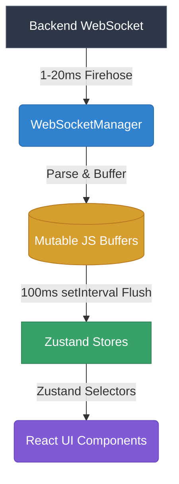

# Delta Trading Dashboard

A real-time, multi-symbol crypto trading dashboard built with React + TypeScript + Vite. It connects to a local WebSocket mock server and displays live order book data, recent trades, and ticker information across 6 symbols simultaneously.

---

## Quick Start

### Prerequisites

- **Node.js** `>= 20.x`
- **npm** `>= 9.x`

### 1. Clone the Repository

```bash
git clone <repository-url>
cd delta-trading-dashboard
```

### 2. Start the Backend Mock Server

The backend WebSocket server lives in the `socket-custom-load` directory. 
You can clone it from: https://github.com/saxenanickk/socket-custom-load

```bash
cd ../socket-custom-load
node index.js
```

> The backend starts on `ws://localhost:8080`. It broadcasts tickers for all 6 symbols and streams order book snapshots and trades for the active symbol.

### 3. Start the Frontend Dev Server

Open a second terminal:

```bash
cd delta-trading-dashboard
npm install
npm run dev
```

Visit `http://localhost:5173` in your browser.

---

## Available Scripts

| Command | Description |
|---|---|
| `npm run dev` | Start the Vite development server with HMR |
| `npm run build` | Type-check and build for production (`dist/`) |
| `npm run lint` | Run ESLint across the entire project |
| `npm run test` | Run the full Vitest unit test suite |
| `npm run preview` | Preview the production build locally |

---

## Features

- **Live Order Book** — Full-depth streaming snapshots with configurable grouping (`0.5`, `1`, `5`, `10` tick sizes), animated depth bars, and spread/imbalance metrics
- **Real-Time Trades Feed** — 100ms trade aggregation with large-trade detection (🔥), rolling 1-minute volume statistics, and auto-scroll with manual override
- **Ticker Bar** — 6-symbol live ticker with 24h price change indicators
- **Symbol Switcher** — Click any ticker to instantly swap the active symbol; old subscriptions are cleanly unsubscribed
- **Connection Status** — Live indicator for `connecting`, `connected`, `reconnecting`, and `disconnected` states with automatic exponential-backoff reconnection
- **Shimmer Loading UI** — Animated skeleton loaders appear while initial data is in flight; existing data is preserved (not wiped) on reconnects
- **Footer Legend** — Inline explanations for every visual affordance in the UI

---

## Architecture

### Architecture in One Paragraph
A pure TypeScript `WebSocketManager` ingests the high-frequency backend firehose and parses messages directly into lightweight, mutable JavaScript buffers. To prevent React from suffocating under 200+ renders per second, a strict `setInterval` loop flushes these buffers exactly once every 100ms (10 FPS) into four granular, domain-specific Zustand stores (`market`, `ticker`, `orderbook`, `trades`), which then selectively re-render heavily-memoized React components without causing Cumulative Layout Shift (CLS).



See [`docs/02-ARCHITECTURE.md`](./docs/02-ARCHITECTURE.md) for a detailed breakdown of component boundaries, state management, WebSocket lifecycle, and data processing pipelines.

## Performance

See [`docs/03-PERFORMANCE-STRATEGY.md`](./docs/03-PERFORMANCE-STRATEGY.md) for an explanation of the buffering model, 100ms flush intervals, CLS elimination, and the main-thread vs. Web Worker tradeoff decision.

## Testing

See [`docs/05-TESTING.md`](./docs/05-TESTING.md) for the test structure, what is covered, and how to interpret the test suite.

## Tradeoffs

See [`docs/06-TRADEOFFS.md`](./docs/06-TRADEOFFS.md) for explicit design decisions including the CPU work placement tradeoff, CLS root cause analysis, and a scaling discussion for significantly more symbols.

---

## Project Structure

```text
delta-trading-dashboard/
├── src/
│   ├── __tests__/              # Parallel test mirror of /src
│   │   ├── services/
│   │   ├── store/
│   │   └── utils/
│   ├── components/
│   │   ├── Layout/             # GlobalHeader, Dashboard, Footer
│   │   ├── OrderBook/          # OrderBookPanel, OrderBookRow, OrderBookMetrics
│   │   ├── TradesFeed/         # TradesPanel, TradesRow
│   │   ├── Tickers/            # TickerBar, TickerCard
│   │   ├── OrderEntry/         # OrderEntryPanel
│   │   └── Shared/             # ConnectionStatusIndicator, TableShimmer, PanelPlaceholder
│   ├── hooks/                  # useWebSocketConnection, useFlashEffect, useTradesDecay
│   ├── services/               # WebSocketManager (singleton)
│   ├── store/                  # Zustand stores (market, ticker, orderBook, trades)
│   ├── types/                  # market.ts TypeScript interfaces
│   └── utils/                  # Pure functions: format, parse, orderbook, trades
├── docs/                       # Architecture and strategy documentation
└── package.json
```

---

## Known Limitations

- The order book UI renders at a capped 10 FPS (100ms flush). This is intentional to prevent main-thread saturation. Visual data is never lost — only intermediate frames are dropped.
- The backend mock server does not support deltas; it sends full order book snapshots on every message.
- `pruneOldTrades` (60s rolling stats) relies on `useTradesDecay`, which polls via a `setInterval`. In a production system this would be replaced with a time-bucketed data structure.
